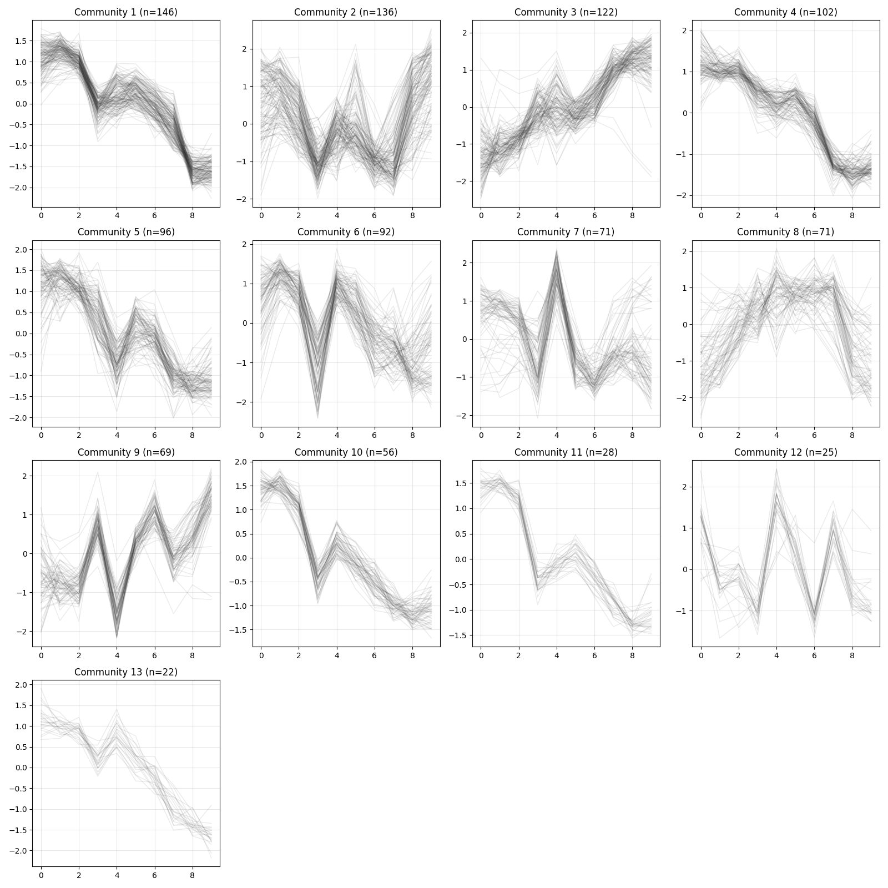

Analysis Workflow in Python
###########################

**xqubit** is a Python package designed for use in Python environments such as Jupyter notebooks or standalone scripts.  
To use **xqubit**, users should prepare gene expression data (i.e., normalized expression values) in a format suitable for analysis in Python.

This tutorial presents a standard workflow for constructing gene co-expression networks using **xqubit**,  
based on a time-series RNA-seq dataset from *Arabidopsis thaliana* collected after germination,  
originally generated to study flower initiation [#f1]_.

The analysis consists of five main steps:

1. Data preparation  
2. Quantum state encoding  
3. Fidelity calculation  
4. Network construction  
5. Visualization  

Data Preparation
****************

**xqubit** requires the following inputs:

- A normalized gene expression matrix  
- An experimental design data frame with ``condition``, ``timepoint``, and ``replicate`` columns  
- Gene identifiers (optional)

Expression data should be organized as a matrix with genes as rows and samples as columns.  
Assuming **normalized** expression data are stored in a tab-delimited file, they can be loaded into Python as follows:

.. note::

    Raw read counts often contain technical biases that can obscure biological signals.  
    Normalization and gene filtering are therefore critical preprocessing steps before constructing networks.  

    Since invariant or lowly expressed genes can generate spurious similarities, such genes should be removed.  
    In practice, preprocessing steps such as normalization and gene filtering are typically performed in R using packages such as  
    `DESeq2 <https://bioconductor.org/packages/release/bioc/html/DESeq2.html>`_ or  
    `edgeR <https://bioconductor.org/packages/release/bioc/html/edgeR.html>`_,  
    which provide well-established analysis frameworks.  

    For this reason, we recommend preparing the data in R and then importing the processed data into Python for downstream analysis with **xqubit**.

.. code-block:: python

    import pandas as pd

    x = pd.read_csv("ath.vst.txt", sep="\t", index_col=0)

    x.head()
    ##            T07_1  T07_2  T08_1  T08_2  T09_1  T09_2  T10_1  T10_2  T11_1  T11_2  T12_1  T12_2  T13_1  T13_2  T14_1  T14_2  T15_1  T15_2  T16_1  T16_2
    ## gene                                                                                                                                                 
    ## AT1G01070  10.68  11.70  11.32  10.99  11.09  10.79   8.35   8.69   9.20   8.28   9.23   8.72   8.28   9.05   7.92   7.24   5.20   5.13   5.12   4.72
    ## AT1G01110   8.26   9.24   8.22   8.37   7.99   8.76   8.86   8.97   8.33   8.59   8.70   8.80   9.16   9.06   9.32   9.61   9.48   9.49   9.45   9.54
    ## AT1G01170   9.82   9.45  10.09   9.51  10.01   9.54   8.99   8.98  10.54  10.76   9.81   9.50   9.35   9.23   9.88   9.68  10.32  10.38  10.64  10.81
    ## AT1G01190  10.09   9.74  10.56  10.56  10.07  10.14   7.83   8.19   7.10   8.03   8.40   8.09   7.75   8.38   6.97   6.37   5.20   5.01   5.00   5.35
    ## AT1G01470   9.93   9.42  10.19  10.05  10.25   9.99   7.82   8.00   8.70   7.98   8.99   8.27   7.62   8.40   7.33   6.90   5.74   5.74   5.75   5.60

As column names of the expression matrix encode experimental conditions
and replicates (``condition_replicate``),
we create the experimental design table by parsing the column names:

.. code-block:: python

    x_design = pd.DataFrame({
        "sample": x.columns,
        "condition": [col.split("_")[0] for col in x.columns],
        "replicate": [col.split("_")[1] for col in x.columns],
        "timepoint": [int(col.split("_")[0][1:]) for col in x.columns]
    })

    x_design
    ##    sample condition replicate  timepoint
    ## 0   T07_1       T07         1          7
    ## 1   T07_2       T07         2          7
    ## 2   T08_1       T08         1          8
    ## 3   T08_2       T08         2          8
    ## 4   T09_1       T09         1          9
    ## ...

    gene = x.index.tolist()
    ## ['AT1G01070', 'AT1G01110', 'AT1G01170', 'AT1G01190', 'AT1G01470', ...]

Quantum State Encoding
***********************

After preparing the data, gene expression profiles are encoded into quantum states using **xqubit**.  
First, import the **xqubit** module and create a :class:`xqubit.ExpressionData` object using the expression matrix and the experimental design data.

.. code-block:: python

    import xqubit

    d = xqubit.ExpressionData(x.values, x_design, gene)

Next, construct quantum-state representations of gene expression profiles.

.. code-block:: python

    psi = xqubit.qstate.build(d, encoding='TDP')

The expression profile of each gene can be visualized using
the :func:`xqubit.ExpressionData.plot_exp` method,
where the x-axis represents conditions (time points)
and the y-axis represents normalized expression values.

.. code-block:: python

    d.plot('AT5G61850', file_name='AT5G61850.exp.png')

.. image:: _static/AT5G61850.exp.png
   :alt: Visualization of expression profile of AT5G61850
   :align: center
   :width: 60%

The corresponding quantum state can be visualized in the complex plane
using the :func:`xqubit.qstate.plot` method.

.. code-block:: python

    idx = d.genes('AT5G61850')
    xqubit.qstate.plot(psi, idx, file_name='AT5G61850.qstate.png')

.. image:: _static/AT5G61850.qstate.png
   :alt: Visualization of quantum state of AT5G61850 in the complex plane
   :align: center
   :width: 40%

Fidelity Calculation
********************

Fidelity between genes is computed using the :func:`xqubit.metrics.calc_fidelity` function.  
This function takes the :obj:`psi` as input and returns a matrix in which rows and columns correspond to genes, and each entry represents the pairwise similarity between gene-specific quantum states.

.. code-block:: python

    fmat = xqubit.metrics.calc_fidelity(psi)

    fmat.shape
    ## (1156, 1156)

    fmat[:5, :5]
    ## array([[1.        , 0.77728261, 0.68946785, 0.99036295, 0.99065266],
    ##        [0.77728261, 1.        , 0.53816368, 0.7698045 , 0.75199344],
    ##        [0.68946785, 0.53816368, 1.        , 0.66055549, 0.72229802],
    ##        [0.99036295, 0.7698045 , 0.66055549, 1.        , 0.98765317],
    ##        [0.99065266, 0.75199344, 0.72229802, 0.98765317, 1.        ]])

Network Construction
********************

To construct a gene–gene network based on fidelity similarities, we use functions from the :mod:`xqubit.nx` module, which provides utilities for network construction and analysis.

Three parameters control network construction and community detection:

- ``f``: minimum fidelity threshold for defining an edge between genes  
- ``k``: number of nearest neighbors retained per gene  
- ``resolution``: resolution parameter for Leiden community detection  

To identify suitable parameter values, a grid search can be performed.  
The :func:`xqubit.nx.scan_network_params` method evaluates each parameter
combination using metrics such as modularity, stability, and the number of detected communities.

.. code-block:: python

    nx_params = xqubit.nx.scan_network_params(
                fmat,
                s_cutoffs = [0.6, 0.7, 0.8, 0.9],
                k_cutoffs = [10, 20, 30],
                resolutions = [1.0, 1.5])

The :func:`xqubit.nx.rank_network_params` function ranks parameter combinations
based on predefined acceptance ranges and Pareto optimality with
respect to selected evaluation metrics.

Using the default settings,
 the top-ranked parameter combination can be retrieved as follows:

.. code-block:: python

    nx_params = xqubit.nx.rank_network_params(nx_params)

    best_params = nx_params.iloc[0]

Note that user can customize the acceptance ranges and optimization variables
by passing the ``opt_vars`` argument to :func:`xqubit.nx.rank_network_params`.

Using the selected parameters, the network is constructed and communities are detected:

.. code-block:: python

    nx = xqubit.nx.build_network(fmat, s = best_params.s, k = best_params.k)
    cl = xqubit.nx.detect_communities(nx, resolution = best_params.resolution)

``cl`` is a list of community labels for each gene, where labels start from 0 and genes sharing the same label belong to the same community.  
Genes with no connections, as well as those in small communities that do not meet the minimum size requirement, are assigned to community 0.  
Community 0 is typically excluded from downstream analyses.

.. code-block:: python

    pd.Series(cl).value_counts()
    ## 1     146
    ## 2     136
    ## 3     122
    ## 0     120
    ## 4     102
    ## 5      96
    ## 6      92
    ## 7      71
    ## 8      71
    ## 9      69
    ## 10     56
    ## 11     28
    ## 12     25
    ## 13     22
    ## Name: count, dtype: int64

The detected communities can also be saved to a file:

.. code-block:: python

    comms_df = pd.DataFrame({
        "gene": d.genes(),
        "community": cl
    })
    
    comms_df.to_csv("communities.txt", sep="\t", index=False)

Visualization
*************

Visualization utilities are available for inspecting expression patterns within detected communities.

.. code-block:: python

    z = d.exp(avg_replicates=True, zscore=True)
    xqubit.nx.plot_communities(cl, z, file_name = "comm_expression.png")

References
**********

.. [#f1] Klepikova AV, Logacheva MD, Dmitriev SE, Penin AA. RNA-seq analysis of an apical meristem time series reveals a critical point in Arabidopsis thaliana flower initiation. BMC Genomics. 2015 Jun 18;16(1):466. doi: 10.1186/s12864-015-1688-9.

