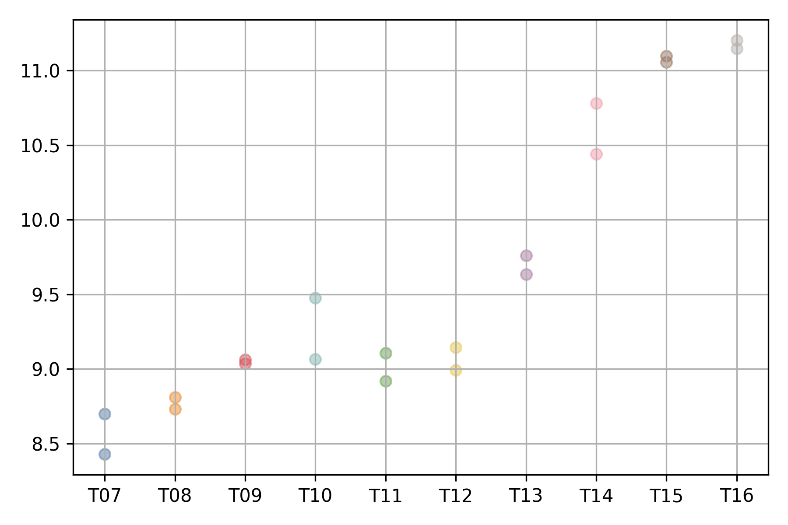
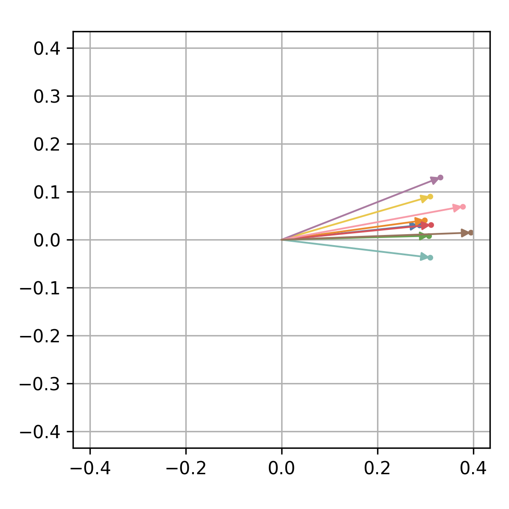
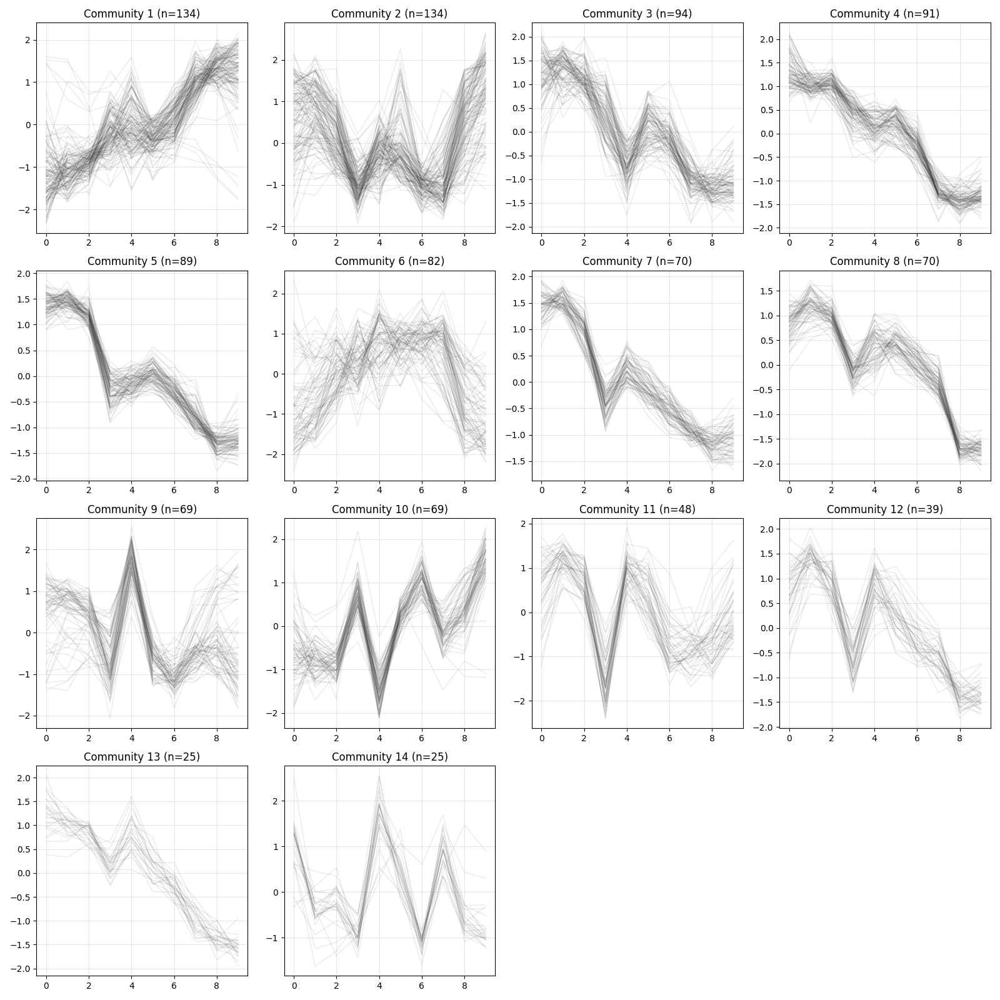

Analysis Workflow in R
######################

**xqubit** is a Python package typically used in Python environments such as Jupyter notebooks or standalone scripts.
However, gene expression data are often preprocessed in R using packages such as DESeq2 or edgeR.
For this reason, this tutorial demonstrates how to use **xqubit** from R via an interface to Python.

We present an example workflow for constructing gene co-expression networks using **xqubit**,
based on a time-series RNA-seq dataset from *Arabidopsis thaliana* collected after germination,
originally generated to study flower initiation [#f1]_.

The analysis consists of five main steps:

1. Data preparation
2. Quantum state encoding
3. Fidelity calculation
4. Network construction
5. Visualization

Data Preparation
****************

**xqubit** requires the following inputs:

- A normalized gene expression matrix  
- An experimental design data frame with ``condition``, ``timepoint``, and ``replicate`` columns  
- Gene identifiers (optional)

Expression data should be organized as a matrix
with genes as rows and samples as columns.  
Assuming raw count data are stored in a tab-delimited file,
they can be loaded into R as follows:

.. code-block:: r

    x <- read.table("ath.counts.txt", header = TRUE, sep = "\t", row.names = 1)

    head(x)
    ##           T07_1 T07_2 T08_1 T08_2 T09_1 T09_2 T10_1 T10_2 T11_1 T11_2 T12_1 ...
    ## AT1G01010    89   183    57   123    60    75   224   105    62    86    98 ...
    ## AT1G01020   271   128   167   368   184   170   718   478   126   189   228 ...
    ## AT1G01030    34     2    20    30    11    14    17    37     1    10    30 ...
    ## AT1G01040  1021   645   653  1196   611   924  2474  1941   720   410  1036 ...
    ## AT1G01046     0     0     0     0     0     0     0     0     0     0     0 ...
    ## AT1G01050  1561  3334  1452  1651  1300  1224  1977  1403  2388  1864  1111 ...

As column names of the expression matrix encode experimental conditions
and replicates (``condition_replicate``),
we create the experimental design table by parsing the column names:

.. code-block:: r

    x_design <- data.frame(
        sample    = colnames(x),
        condition = sapply(strsplit(colnames(x), "_"), `[`, 1),
        replicate = sapply(strsplit(colnames(x), "_"), `[`, 2),
        timepoint = as.integer(gsub("T", "", sapply(strsplit(colnames(x), "_"), `[`, 1)))
    )

    x_design
    ##    sample condition replicate timepoint
    ## 1   T07_1       T07         1         7
    ## 2   T07_2       T07         2         7
    ## 3   T08_1       T08         1         8
    ## 4   T08_2       T08         2         8
    ## 5   T09_1       T09         1         9
    ## ...

Raw read counts often contain technical biases that can obscure biological signals.  
Normalization and gene filtering are therefore critical preprocessing steps
before constructing networks.

Here we apply variance stabilizing transformation (VST),
implemented in `DESeq2 <https://bioconductor.org/packages/release/bioc/html/DESeq2.html>`_ [#f2]_,
for raw counts.
One can use other normalization methods as well,
such as regularized log transformation of TPM values or log transformed TMM counts.

.. code-block:: r

    library(DESeq2)

    dds <- DESeqDataSetFromMatrix(x, x_design, design = ~ condition)
    dds <- estimateSizeFactors(dds)
    x_norm <- assay(vst(dds, blind = TRUE))

Since invariant or lowly expressed genes can generate spurious similarities,
genes with low expression or low variability should be removed.
The thresholds used below are example values and should be adjusted
depending on the characteristics of the dataset.

.. code-block:: r

    f1 <- (rowSums(x_norm >= 5) >= (ncol(x_norm) / 3))
    f2 <- (apply(x_norm, 1, mad) > 0.5)
    x_norm <- x_norm[f1 & f2, ]

The resulting matrix ``x_norm`` contains normalized expression values
for genes with sufficient expression and variability,
ready for downstream analysis with **xqubit**.

.. code-block:: r

    dim(x_norm)
    ## [1] 1156   20

    head(x_norm)
    ##               T07_1     T07_2     T08_1     T08_2     T09_1     T09_2    T10_1 ...
    ## AT1G01070 10.813749 11.768753 11.404468 11.101382 11.188867 10.918834 8.869768 ...
    ## AT1G01110  8.806264  9.565552  8.780190  8.890654  8.613121  9.180422 9.256020 ...
    ## AT1G01170 10.051471  9.732266 10.286921  9.787186 10.216392  9.812231 9.358475 ...
    ## AT1G01190 10.285683  9.978618 10.705898 10.702856 10.268512 10.328980 8.509345 ...
    ## AT1G01470 10.144925  9.706032 10.369087 10.252375 10.426127 10.194991 8.499688 ...
    ## AT1G01580  7.961483  8.341188  7.890097  8.035285  8.010770  8.045538 7.551140 ...

Quantum State Encoding
**********************

After preparing the data, gene expression profiles are embedded into quantum states using **xqubit**.
Because **xqubit** is implemented in Python,
we access it from R via the `reticulate <https://rstudio.github.io/reticulate/>`_ package,
which provides an interface for calling Python functions from within R.

First, load **reticulate** and specify the Python environment where **xqubit** is installed:

.. code-block:: r

    library(reticulate)

    use_python("/bin/python", required = TRUE)  # adjust path as needed

Next, import the **xqubit** module in R
and create a :class:`xqubit.ExpressionData` object
using the normalized expression matrix
and the experimental design data frame.

.. code-block:: r

    xqubit <- import("xqubit")

    d <- xqubit$ExpressionData(as.matrix(x_norm), x_design, rownames(x_norm))

Then, build quantum-state embeddings.

.. code-block:: r

    psi <- xqubit$qstate$build(d, encoding='TDP')

The expression profile of each gene can be visualized using
the :func:`xqubit.ExpressionData.plot` method,
where the x-axis represents conditions (time points)
and the y-axis represents normalized expression values.

.. code-block:: r

    d$plot('AT5G61850', file_name='AT5G61850.exp.png')

The corresponding quantum state can be visualized in the complex plane
using the :func:`xqubit.qstate.plot` method.

.. code-block:: r

    idx <- d$genes('AT5G61850')
    xqubit$qstate$plot(psi, idx, file_name='AT5G61850.qstate.png')

Fidelity Calculation
********************

Fidelity between genes is calculated using the :func:`xqubit.metrics.calc_fidelity` function,
which takes the :obj:`psi` as input and returns a fidelity matrix
where rows and columns correspond to genes and values represent pairwise similarity.

.. code-block:: r

    fmat <- xqubit$metrics$calc_fidelity(psi)

    dim(fmat)
    ## [1] 1156 1156

    head(fmat)
    ##           [,1]      [,2]      [,3]      [,4]      [,5]      [,6]      [,7] ...
    ## [1,] 1.0000000 0.8027602 0.7253503 0.9887822 0.9910231 0.9532281 0.8772183 ...
    ## [2,] 0.8027602 1.0000000 0.5417154 0.7918268 0.7628359 0.9059334 0.9328506 ...
    ## [3,] 0.7253503 0.5417154 1.0000000 0.6901691 0.7442489 0.6326834 0.7284880 ...
    ## [4,] 0.9887822 0.7918268 0.6901691 1.0000000 0.9875654 0.9556262 0.8796378 ...
    ## [5,] 0.9910231 0.7628359 0.7442489 0.9875654 1.0000000 0.9366521 0.8680249 ...
    ## [6,] 0.9532281 0.9059334 0.6326834 0.9556262 0.9366521 1.0000000 0.9344884 ...

Network Construction
********************

To construct a gene-gene network based on fidelity similarities,
we use functions from the :mod:`xqubit.nx` module, which implements
a flexible framework for building and analyzing networks.

There are three parameters that control network construction and community detection:

- ``f``: minimum fidelity value required for a gene-gene connection
- ``k``: number of nearest neighbors retained per gene
- ``resolution``: resolution parameter for Leiden community detection

To identify suitable parameter values, a grid search can be performed.
The :func:`xqubit.nx.scan_network_params` method evaluates each network
based on modularity, stability, number of detected communities, and other metrics.

.. code-block:: r

    nx_params <- xqubit$nx$scan_network_params(
                fmat,
                s_cutoffs = c(0.6, 0.7, 0.8, 0.9),
                k_cutoffs = c(10, 20, 30),
                resolutions = c(1.0, 1.5))

The :func:`xqubit.nx.rank_network_params` function ranks parameter combinations
based on predefined acceptance ranges and Pareto optimality with
respect to selected evaluation metrics.
Using the default acceptance ranges and optimization variables,
we can inspect the ranked parameter combinations as follows:

.. code-block:: r

    nx_params <- xqubit$nx$rank_network_params(nx_params)

    nx_params <- data.frame(nx_params$to_dict(orient='list'))
    best_params <- nx_params[1, ]

Note that user can customize the acceptance ranges and optimization variables
by passing the ``opt_vars`` argument to :func:`xqubit.nx.rank_network_params`.

Using the selected parameters, the fidelity network is constructed
and communities are detected:

.. code-block:: r

    nx <- xqubit$nx$build_network(fmat, s = best_params$s, k = best_params$k)
    cl <- xqubit$nx$detect_communities(nx, resolution = best_params$resolution)

``cl`` is a vector of community labels for each gene,
where labels start from 0 and genes sharing the same label belong to the same community.
Genes with no connections, as well as those in small communities that do not meet the minimum size requirement,
are assigned to community 0.
Thus, community 0 is typically excluded from downstream analyses.

.. code-block:: r

    table(cl)
    ##   0   1   2   3   4   5   6   7   8   9  10  11  12  13  14 
    ## 117 134 134  94  91  89  82  70  70  69  69  48  39  25  25 

Communities can also be saved to a file:

.. code-block:: r

    comms_df <- data.frame(gene = rownames(x_norm), community = cl)

    write.table(comms_df, "communities.txt",
                sep = "\t", row.names = FALSE, col.names = TRUE, quote = FALSE)

Visualization
*************

Visualization utilities are available
for inspecting expression patterns within communities.

.. code-block:: r

    z <- d$exp(avg_replicates = TRUE, zscore = TRUE)
    xqubit$nx$plot_communities(cl, z, file_name = "comm_expression.png")

References
**********

.. [#f1] Klepikova AV, Logacheva MD, Dmitriev SE, Penin AA. RNA-seq analysis of an apical meristem time series reveals a critical point in Arabidopsis thaliana flower initiation. BMC Genomics. 2015 Jun 18;16(1):466. doi: 10.1186/s12864-015-1688-9.
.. [#f2] Love MI, Huber W, Anders S. Moderated estimation of fold change and dispersion for RNA-seq data with DESeq2. Genome Biol. 2014;15(12):550. doi: 10.1186/s13059-014-0550-8.
